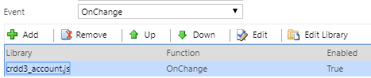

# On Key Press control

## Description

This control will fill the gap the [addOnKeyPress](https://docs.microsoft.com/en-us/previous-versions/dynamicscrm-2016/developers-guide/gg334266(v=crm.8)#addonkeypress) has left.
It has been created to trigger the onChange of the field in each key press.

## Download

[DOWNLOAD LATEST RELEASE](https://github.com/victorsolaya/PCF-On-Key-Press/releases/latest)

## How to configure

1. Add the control to the field that needs the onChange
2. The control will trigger the event onChange of the field in the onKeyPress

## Example of configuration

## Which fields are supported

At the moment are supported all of the fields allowed by the Power Component Framework [here to the documentation](https://docs.microsoft.com/en-us/powerapps/developer/component-framework/manifest-schema-reference/type#value-element)